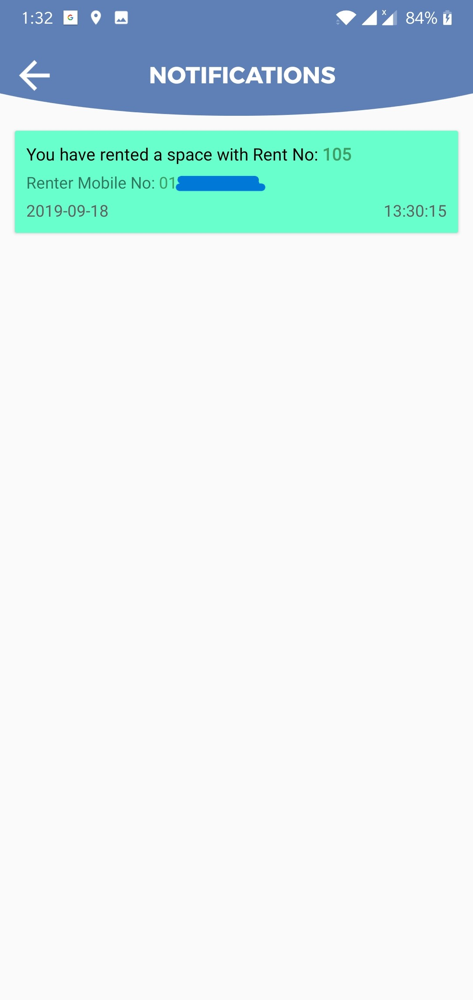
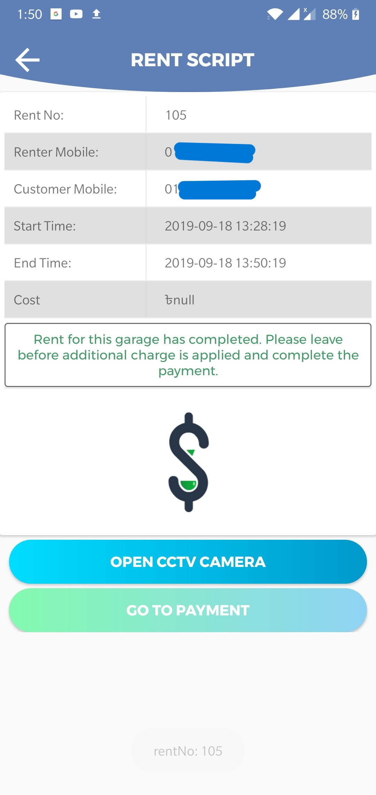

```
Software Development - CSE 408
```

<p align="center">
  
</p>

### Department: Computer Science and Engineering

### ParkIn: A Smart Parking App

### Made by:
---
#### Md.Rajibul Islam | Student ID: 1505001
#### Ahnaf Faisal | Student ID: 1505005
#### Raihanul Alam Hridoy | Student ID: 1505010
---
## 1 Abstract

The number of personal vehicles usage is increasing manifold. People prefer personal vehicles to
commute than depend on public transportation. Finding a parking space in most metropolitan
areas, especially during the rush hours, is difficult for drivers. Due to this there is a need
to provide sufficient parking places coupled with plenty of slots to help the user park his
vehicle safely, also to ensure the user does not end up parking on non-parking area and cause
discomfort to pedestrian.Due to this there is a need to provide sufficient parking places coupled
with plenty of slots to help the user park his vehicle safely, also to ensure the user does not
end up parking on non-parking area and cause discomfort to pedestrian. The idea behind our
Android Application- “**ParkIn**” is to help the user analyse area’s where parking is available and
number of slots free in that area.Additionally, the user can pre-book a slot in the area he desires
for some consecutive days (along with the daily service) if it is available. This will help reduce
the load on the administrator as his physical work reduces drastically and user can search the
parking slot through Android Application.User can pay after completion of parking service he
received. “**ParkIn**” Application relieves the user from the hassle of manually searching and
waiting for empty slots to park the vehicle.

## 2 Introduction

Android is an operating system, developed for mobile devices like Smartphone’s and tablet
computer, which is based on Linux operating system.With the rapid proliferation of vehicle
availability and usage in recent years, finding a vacant vehicle parking space is becoming more
and more difficult, resulting in a number of practical conflicts.Parking problems are becoming
ubiquitous and ever growing at an alarming rate in every major city. Wide usage of android
technology with the recent advances in wireless applications for parking, manifests that digital
data dissemination could be the key to solve emerging parking problems.Now-a-days there is
a steady increase in the number of people using Android mobile phones.We intoduce a Smart
Parking System based on android technology for avoiding the parking problems which provides
process of pre-booking the slots through the use of a simple and interactive Android application.
This application is expected to provide an efficient and cost-effective solution to the effluent
vehicle parking problems.The user needs to have an Android enabled device to reap the benefits
of this application. After installing the “**ParkIn**” app, user needs to mandatorily register with
the application. Booking of the slot at user’s desired location should be done prior to the arrival.
Penalty will be levied on late arrival as well as on over use of the slot after user specified entry
and exit time. The places where security surveillance (CCTVs) is made available will be used
by the administrator to keep a track of the vacant or occupied slots.Else, physical presence of
the administrator at the slot site will be required. During reservation process the client needs
to provide with details that includes booking person’s mobile no., vehicle number, expected
entry and exit time.


## 3 Architectural Design

“**ParkIn**” application is based on the client-server architecture. The client is provided with
an interactive Android based user interface for the process of pre-booking of parking slot and
renting his garage as a renter. The server side processing will be enabled using PHP and
MySQL. The client requests the server for locations where parking is available and the server
responds with slots availability.Also,server offers the renter to rent his garage and make a way
to earn money.

<p align="center">
  
  <br>
  <br>
  Figure 1: Client Server Architecture of ParkIn App
</p>

### 3.1 Class Diagram

This section contains 2 MVC pattern class diagrams for our design Figure 2 shows a boundary classGarageUI, a control classGarage Additionand three entity classes:Owner,Garage,Rajuk
Figure 3 shows a boundary classSpaceInqUI, a control classSpaceInq Controllerand
two entity classes: Customer,Vehicle

<p align="center">
  
  <br>
  <br>
  Figure 2: Class Diagram for Add Garage
</p>

### 3.2 Sequence Diagram

Figure 4 shows the sequence diagram for Add garage usecase. Initially a user interface is loaded and renter actor selects garage from the garage list. After selecting the garage,renter gets the details about the garage. Then, renter adds garage via an instance of Add Garage class and Garage constructor creates new instance for the newly added garage. Figure 5 shows the sequence diagram for Inquire Space Subsystem. At first, customer shows a map with nearest locations with available spaces and choose this space while getSpace method shows the details about the space.Now, customer choose the space to rent if it is available. He/She also adds vehicle via selecting from the vehicle list and confirms the space to rent.

<p align="center">
  
  <br>
  <br>
  Figure 3: Class Diagram for Inquire Space
</p>

<p align="center">
  
  <br>
  <br>
  Figure 4: Sequence Diagram for Add Garage
</p>

<p align="center">
  
  <br>
  <br>
  Figure 5: Sequence Diagram for Inquire Space
</p>

## 4 User Guide/Implementation

### 4.1 Client Side

#### 4.1.1 Starting the Application

The user needs to install the “ParkIn” application on his Android based device. After installation, the icon of the app will feature on the Home Screen of the user’s device. “ParkIn” Home Screen will be flashed to the user on opening the application.

#### 4.1.2 Registration

Initially, the user has to register his details with the application for the first time. This is a one-time registration. The user has to enter details like mobile no. as username,name, email-id,address,birthdate etc.

<p align="center">
  
  
  
  <br>
  Figure 6: (a) Create Account (b) Create Account Activity with Details
  <br>
</p>

All this data will be stored on server and confidentiality will be ensured. User can then book slot and also rent garage slot using same registered account. We use Google’s firebase authentatication system to send verification emails and verify.

<p align="center">
  
  
  
  <br>
  Figure 7: (a) Verification Email (b) Email Verified
  <br>
</p>


#### 4.1.3 LogIn

Once the user registers, he can use his mobile number to login in future. This authenticates the user. After login he can see his profile,history,available garages,vehicles information etc.

<p align="center">
  
  <br>
  Figure 8: Login Activity
  <br>
</p>

### 4.2 Home

From this window user can go to add garage,vehicle or search for parking location,see ongoing status,notifications and logout.

<p align="center">
  
  <br>
  Figure 9: Home Activity
  <br>
</p>

#### 4.2.1 Vehicle Details

A user can enter vehicles he wishes to park in vehicle window.

<p align="center">
  
  
  
  <br>
  Figure 10: (a) Vehicle Add Window (b) Vehicle List Window
  <br>
</p>

#### 4.2.2 Adding Garage as Renter

User’s single registered account provides him services of both as the customer and the renter. He can add garage and provide garage spaces for rent in a specified time-interval.To rent spaces, detials of spaces have to be inserted and all records will be stored in the server side database. User can also deactivate the availabilty of his rented space for a certain period and activate then with new initialized date.While adding garage, a record for the user is created as renter and this record will be stored in the database.

<p align="center">
  
  
  <br>
  <br>
  Figure 11: (a) Garage Add Search (b) Garage Add Search Suggestion
  <br>
  <br>
</p>

<p align="center">
  
  
  <br>
  <br>
  Figure 12: (a) Garage Add Location Map (b) Garage Add Details Size Selection
  <br>
</p>

#### 4.2.3 Location Selection for Parking

The user selectsParking Location Iconfor getting available garages. By selecting desired garage with Arrival and Departure time along with the vehicle type, user can see multiple spaces available for him. User has to select one of the spaces provided where he desires to park
the vehicle.

<p align="center">
  
  
  
  <br>
  <br>
  Figure 13: (a) Search Location Window (b) Available Space List (c) Vehicle Selection
  <br>
</p>

#### 4.2.4 Notification Details

The server sends notification to renter and client side when renting time has started and when it is over.

<p align="center">
  
  
  <br>
  <br>
  Figure 14: (a) List of Notifications (b) Single Notification
  <br>
</p>


### 4.3 Confirmation and Payment

When user selects slot for rent, a request is sent to the server and server responses with the confirmation status on user window. Also,Server sends notification to the user with details information about the pre-booking of slot.

<p align="center">
  
  
  <br>
  <br>
  Figure 15: (a) Payment Notifications (b) Payment Window
  <br>
</p>

User will have to confirm his payment. Our payment window has payment methods. After confirmation, the service will be completed. We haven't implemented the API for the methods as it is paid API.

### 4.4 Server Side

The server side processing will be enabled using PHP and MySQL. The administrator has to control the server side. Whenever a new user registers with the app, the record will be stored in the server side database. When the registered user selects the location and vehicle type, immediately server receives the client’s request. After receiving the request for the desired location, server processes the related information and responds accordingly. Furthermore, the administrator has direct option to view user details and slot details stored on the server direct via the application. There will also be a ongoing server written in java which will run threads to see if rent time is starting for a customer or ending and thus sending proper notifications.

<p align="center">
  
  <br>
  <br>
  Figure 16: Server Running
  <br>
</p>

## 5 Future Scope

There are some future scope for this project.At this moment,the software does not allow cus-
tomers to share a space if it is big enough.Although it allows concurrency in different timelines
but not during same time.The payment method can be implemented using paid apis like bkash
or rocket which is absent from the app at the moment.There is in app communication sys-
tem between users at the moment which can be added.Also the app doesnot allow extra time
allocation at the moment which can be added fairly easily.

## 6 Conclusion

All in all, we think parkin app brings the features which are necessary for a country like us
where there is a significant shortage of parking space.Also it allows some users to earn some
money through renting their space.We hope that we can continue to make improvement to this
project.
